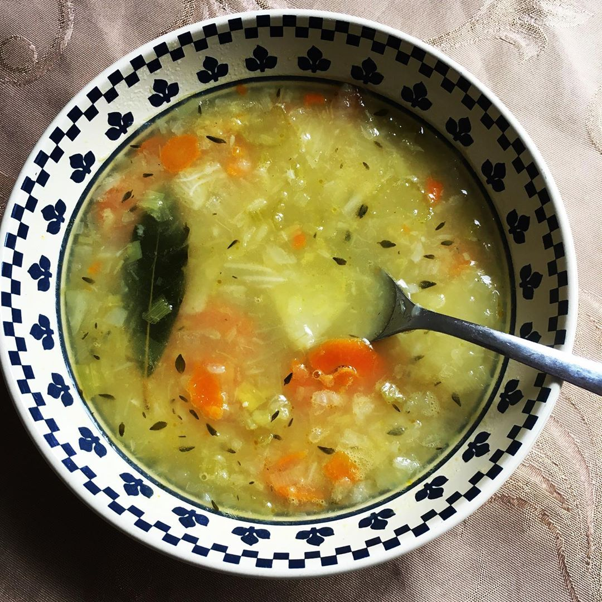

# Le bouillon de légumes de papi

## Le marché...

|  Ingrédient                      | Quantité (4 personnes)|
| :--------------------------------| :------------------   |
| Poireau                          | 1                     |
| Céleri                           | 2 tiges               |
| Navet                            | 2                     |
| Pomme de terre                   | 1                     |
| Oignon jaune                     | 1 gros                |
| Carotte                          | 1 grosse              |
| Bouillon de volaille             | 1 cube                |
| Feuilles de laurier              | 3                     |
| Thym                             | 2 branches            |
| Poivre                           |                       |
| Sel                              |                       |

