# Mes maxi-cookies aux pépites de chocolat

## La liste de courses
--------------

|  Ingrédient                       | Quantité (20 cookies) | Quantité (30 cookies) | Quantité (45 cookies) |
| :---------------------------------| :---------------------| :---------------------| :---------------------|
| Oeufs                             | 3                     | 4                     | 6                     |
| Beurre                            | 200 g                 | 250 g                 | 400 g                 |
| Farine                            | 350 g                 | 440 g                 | 700 g                 |
| Sucre                             | 200 g                 | 250 g                 | 400 g                 |
| Sucre vanillé                     | 1 sachet              | 1 1/4 sachets         | 2 sachets             |
| Chocolat                          | 1 tablette (200 g)    | 1 1/4 tablette (250 g)| 2 tablettes (400 g)   |
| Levure                            | 2,5 cuillères à café  | 3 cuillères à café    | 5 cuillères à café    |
| Sel                               | 1 cuillères à café    | 2 cuillères à café    | 2 cuillères à café    |
| Smarties                          | 2 tubes  (5 boites)   | 2,5 tubes (7 boites)  | 4 tubes (10 boites)   |

## Cuisson
-----------
11 minutes sur une plaque métallique dans un four préchauffé à 180°C

## Etapes détaillées
--------------------

### 1. Préparer les pépites
1.a. Couper le chocolat en morceaux

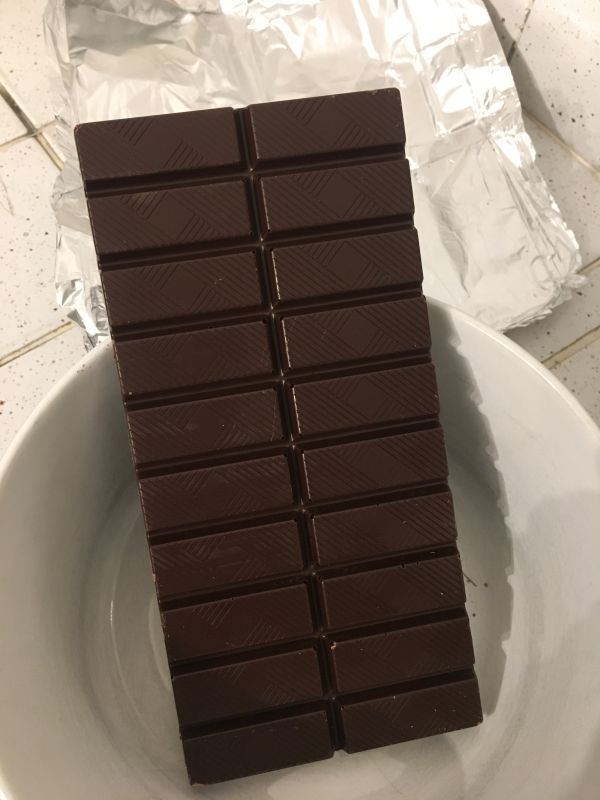

1.b. Concasser les morceaux pour les réduire en pépites
(éventuellement au mixer)

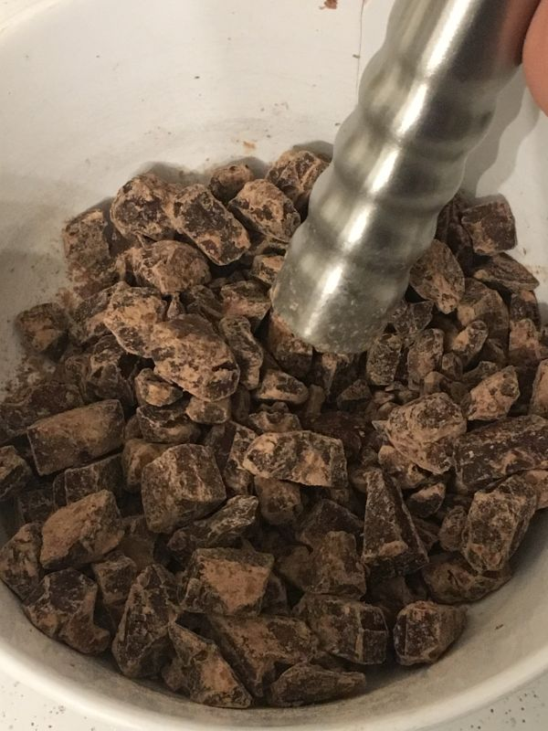

### 2. Préparer la pâte
2.a. Casser les oeufs (entiers) dans un saladier et ajouter le beurre

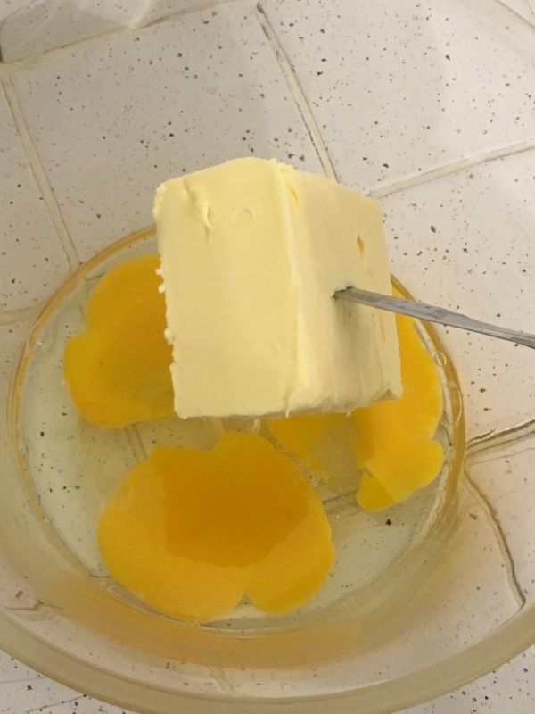

2.b. Ajouter le sucre et le sucre vanillé

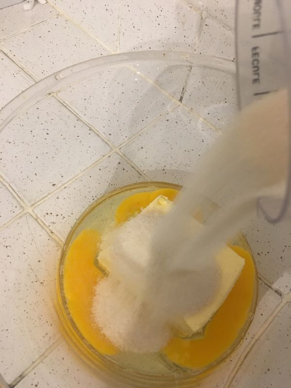

2.c. Ecraser et mélanger le tout...

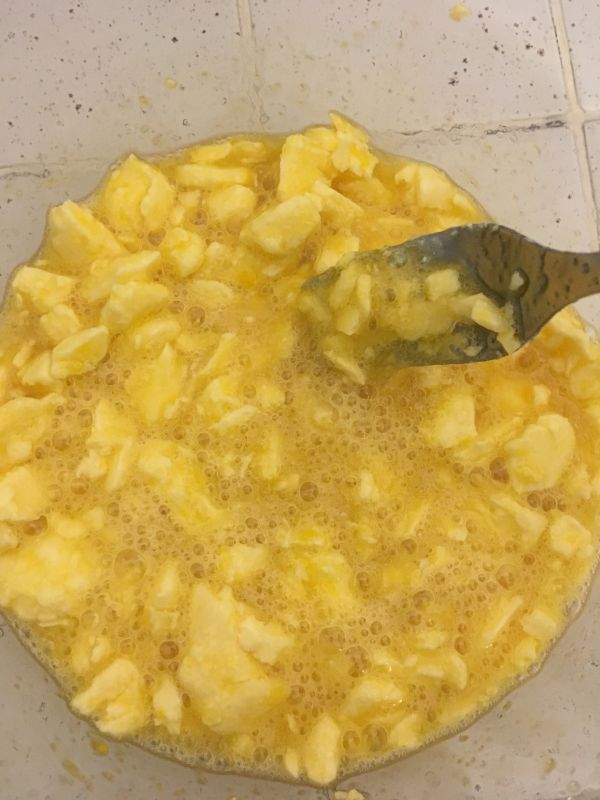

2.d. ...jusqu'à obtenir une pâte homogène

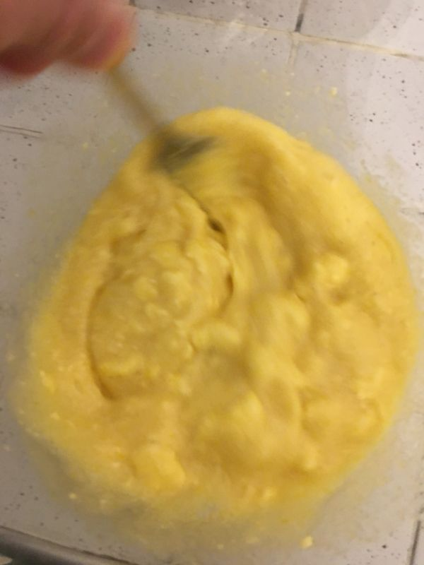

2.e. Ajouter progressivement la farine mélangée au sel et à la levure et malaxer 💪💪

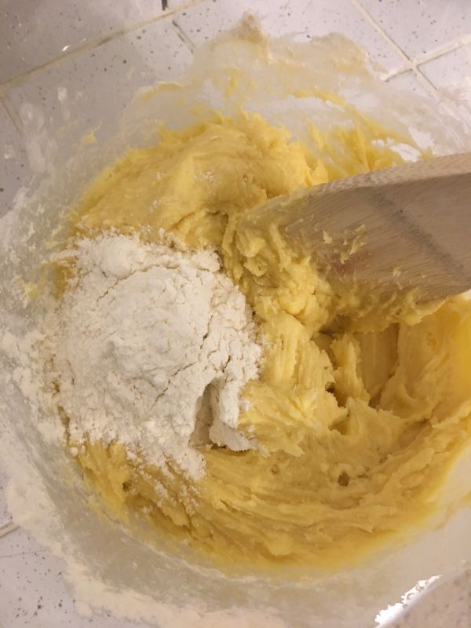

2.f. Ajouter les pepites de chocolat

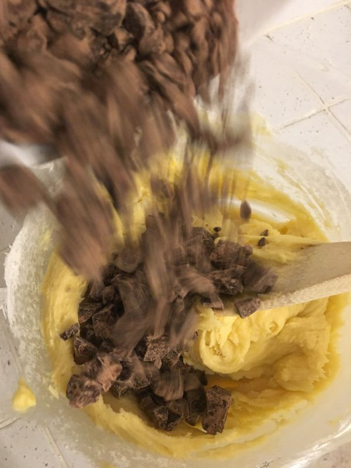

2.g. Mélanger la pâte

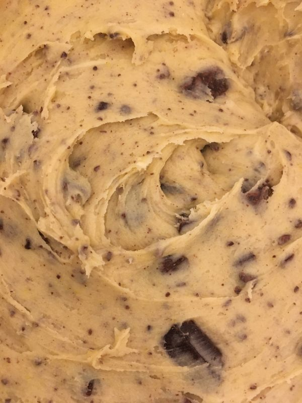

### 3. La garniture (en option)
Concasser des smarties en morceaux

### 4. Cuisson
4.a. Répartir des boules de pâte sur une plaque recouverte de papier cuisson en les espaçant

(ici le fond amovible d'un moule à manqué)

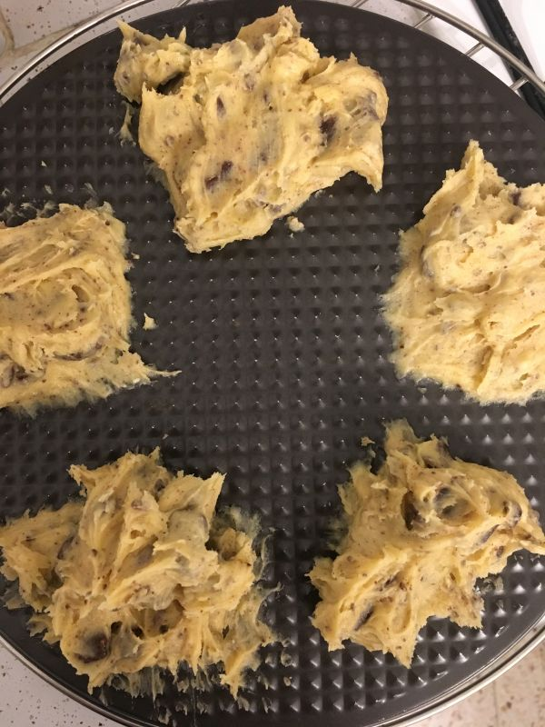

4.b. Saupoudrer les smarties sur les cookies (en option)

4.c. Faire cuire à 180°C pendant 11 minutes

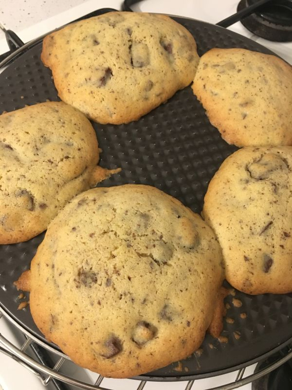

### 6. C'est parti pour le goûter (ou le petit-déjeuner) !

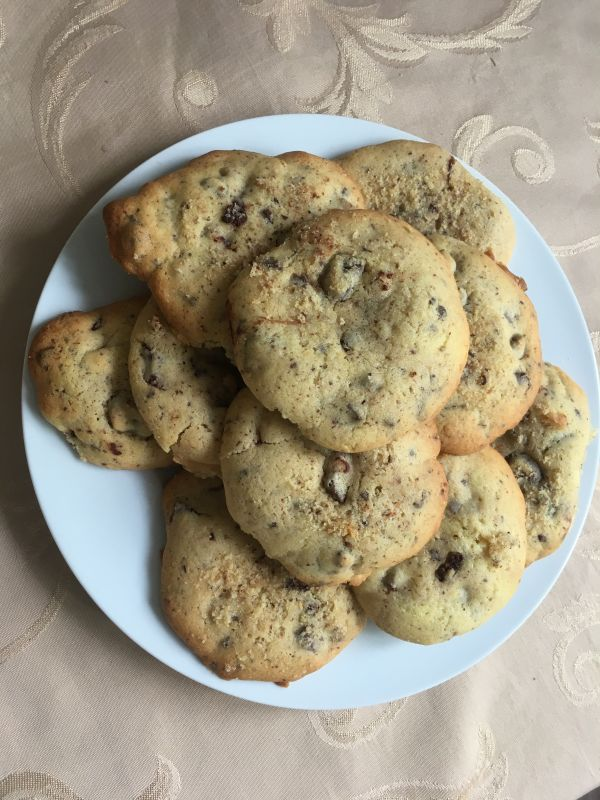

## Source
--------------
source : [https://www.marmiton.org/recettes/recette_cookies-maison_86989.aspx#recipe-step-by-step__index]

mais j'ajoute ma touche perso :
* les dosages sont légèrement différents
* leurs quantités pour 9 personnes me permettent de faire 15 maxi-cookies
* je garnis de smarties
* la cuisson est de 11 minutes pour des maxi-cookies