# Mes fajitas Old El Paso™, *pour los gringos affamés*

## Le matos
--------------

|  Ingrédient                       | Quantité (2 personnes)|
| :---------------------------------| :---------------------|
| Escalopes de dinde                | 3 (360 g)             |
| Sauce tomate (cuisinée)           | 200 g                 |
| Oignon blanc                      | 1                     |
| Poivron vert                      | 1                     |
| Poivron rouge                     | 1                     |
| Citron jaune                      | 1 demi                |
| Avocat                            | 1                     |
| Emmental râpé                     | 100 g                 |
| Crème fraiche épaisse             | 20 cl                 |
| Beurre                            | 25 g                  |
| Huile d'olive                     |                       |
| Galettes (blé ou maïs)            | 6 (1 paquet)          |
| Mélange aux épices pour fajitas   | 1/4 de sachet         |
| Mélange aux épices pour guacamole | 1/4 de sachet         |
| Chips de maïs nature              | 1 paquet              |

## Etapes détaillées
--------------------

### 1. Le guacamole
1.a. Mettre l'avocat dans un bol

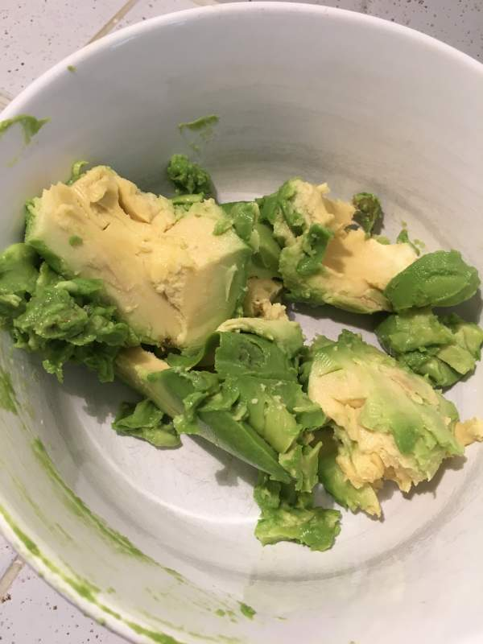

1.b. Bien écraser avec une fourchette et ajouter le mélange aux épices "guacamole"

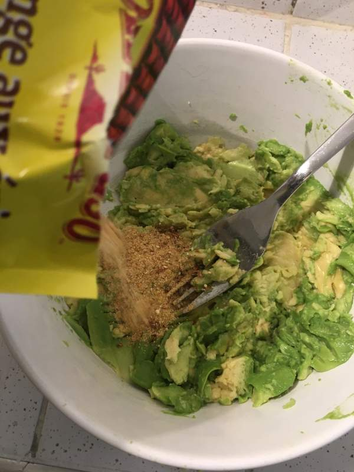

1.c. Ajouter le jus d'un demi-citron

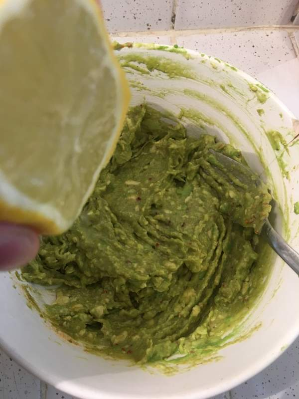

1.d. Mélanger jusqu'à obtenir une crème onctueuse

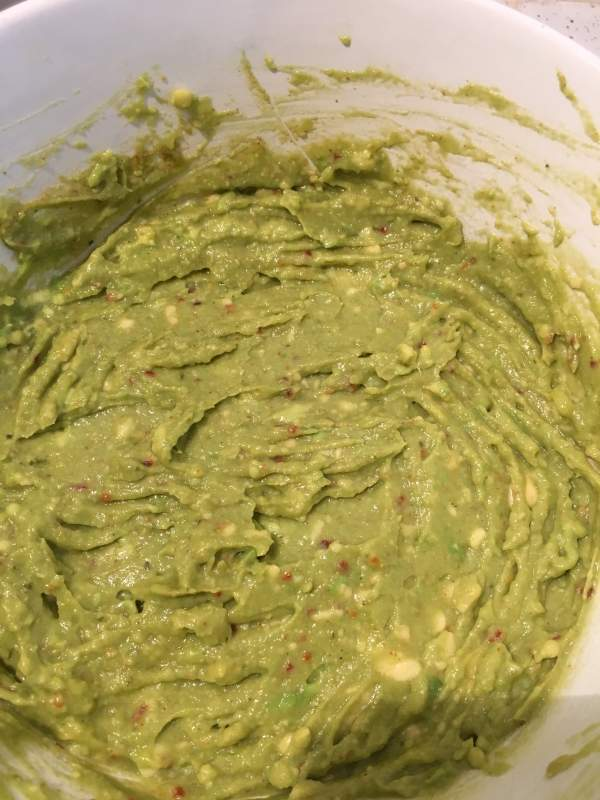

### 2. La viande
2.a. Couper la dinde en morceaux

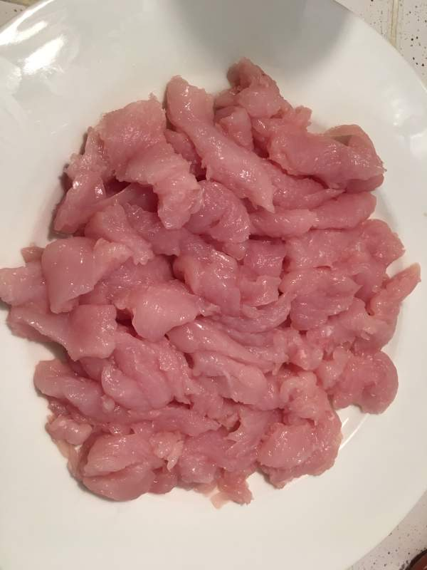

2.b. Faire cuire dans du beurre

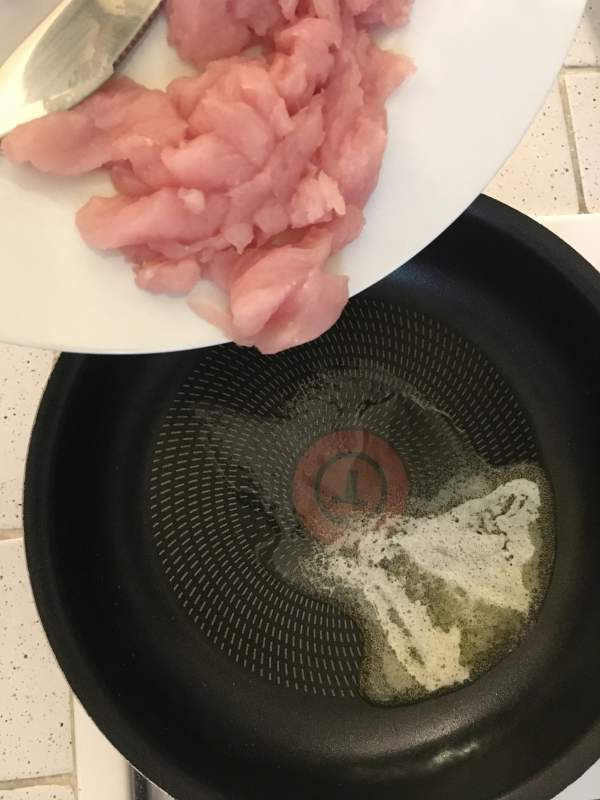

2.c. Une fois les morceaux bien dorés, ajouter du mélange aux épices "fajitas"

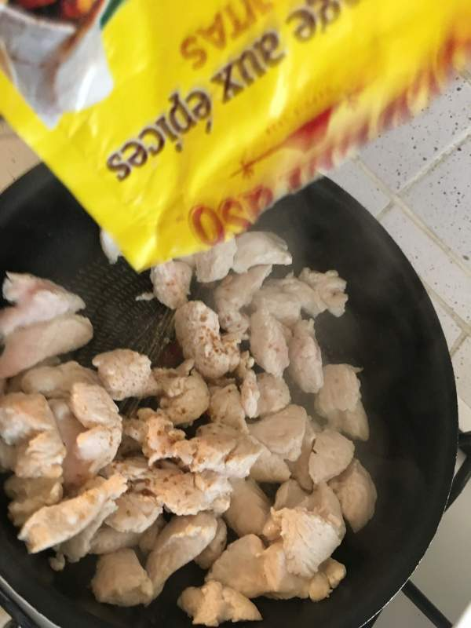

2.d. Une fois la viande cuite, verser une assiette creuse

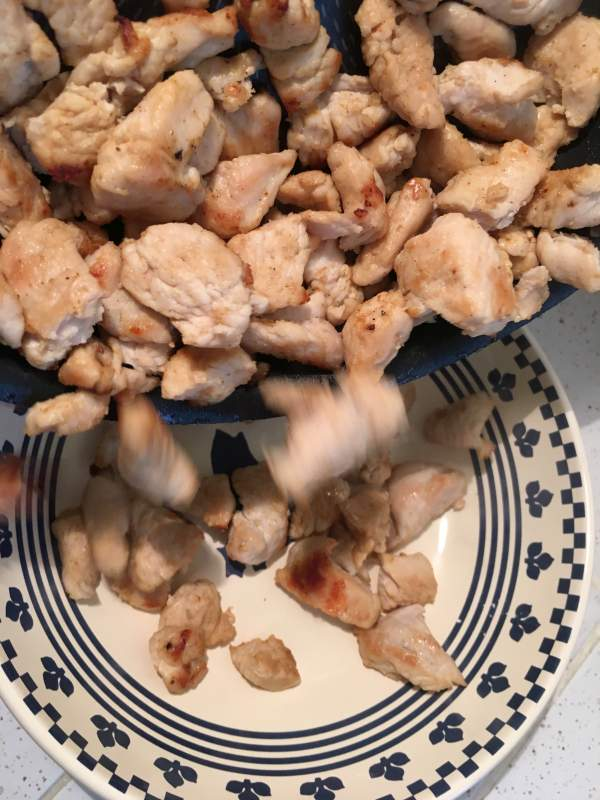

### 3. Les légumes
3.a. Couper les poivrons et l'oignon en lamelles

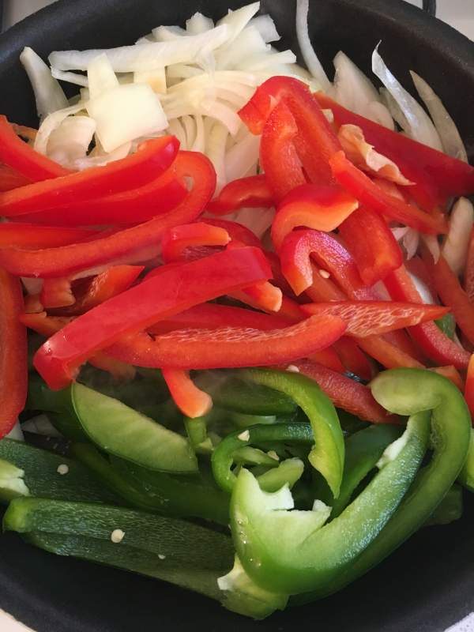

3.b. Verser du mélange aux épices "fajitas"

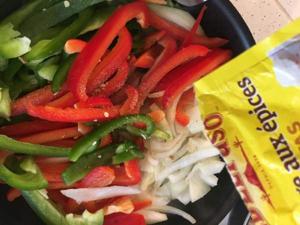

3.c. Puis faire cuire à feu doux pendant 10 minutes

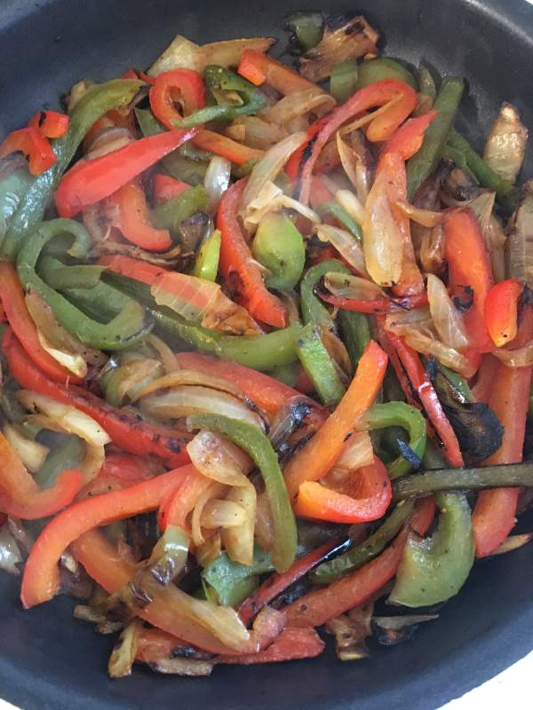

3.d. Enfin verser dans une assiette creuse

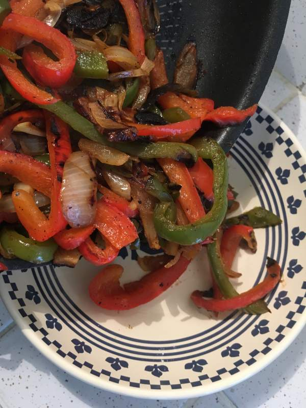

### 4. Les sauces, condiments et galettes
4.a. Verser la sauce tomate dans un ramequin et la chauffer 30 secondes au micro-ondes

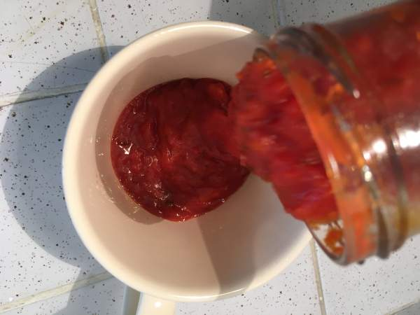

4.b. Verser le fromage et la crème fraîche dans des ramequins

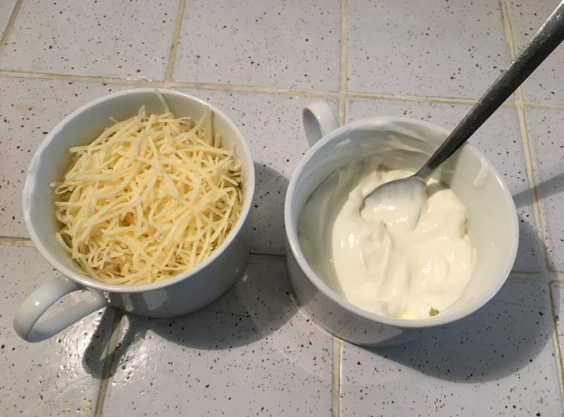

4.c. Faire chauffer les galettes 30 secondes au micro-ondes

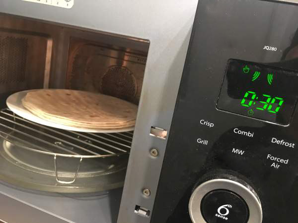

### 5. Installer les préparations sur la table

### 6. Préparer les fajitas
6.a. Charger avec tout ce qui vous tente, en commençant pas la crème fraîche ou la sauce tomate

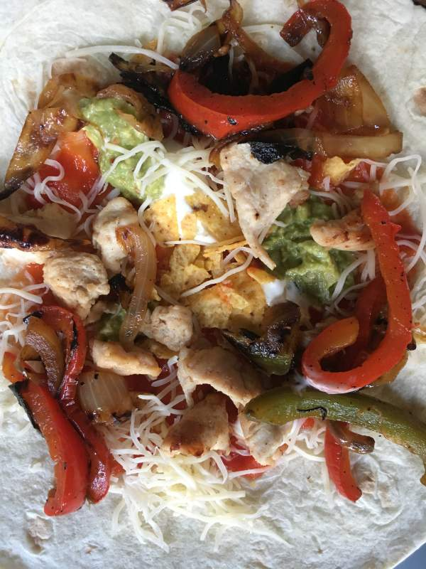

6.b. Rabattre le bas de la galette

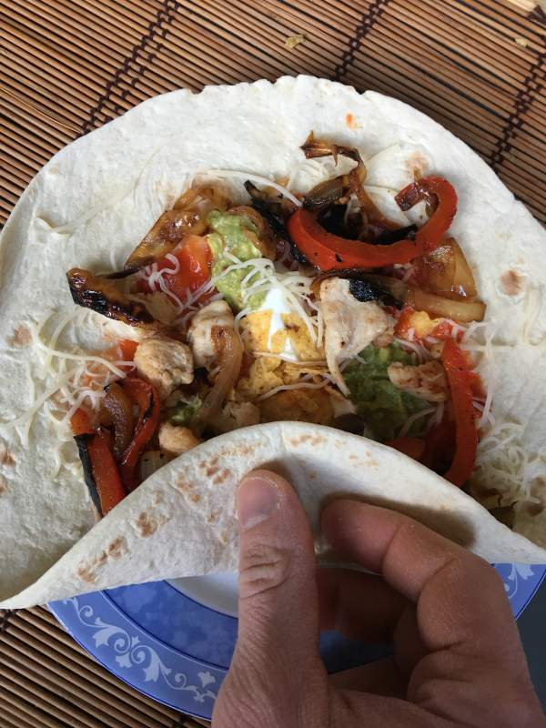

6.b. Puis les bords gauche et droite

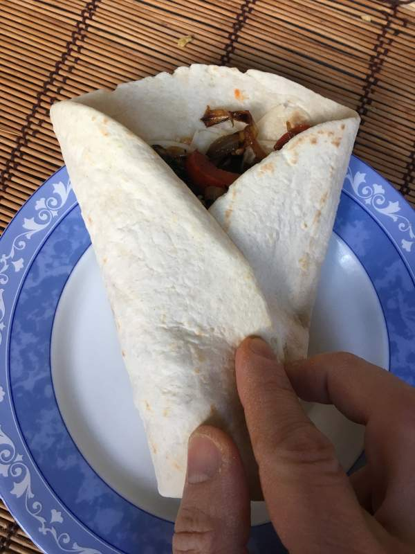

### 7. Faites tomber les sombréros et régalez-vous
Avec une margarita bien fraîche 🍸

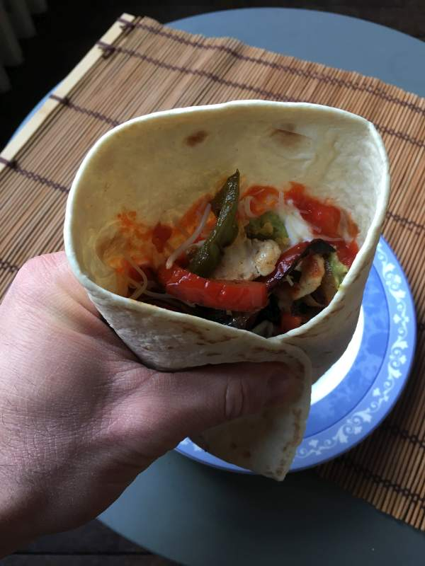

