# le légendaire fondant au chocolat

## Ingrédients
--------------

|  Ingrédient                      |  King size (12 pers.) | Normal (6 pers.)   |
| :--------------------------------| :------------------   | :------------------|
| oeufs                            | 8                     | 4                  |
| chocolat noir (tablettes dessert)| 400 g (2 tablettes)   | 200 g (1 tablette) |
| beurre demi-sel                  | 150 g                 | 75 g               |
| sucre en poudre                  | 200 g                 | 100 g              |
| farine                           | 250 g                 | 125 g              |
| Pralin en poudre                 |                       |                    |

## Cuisson
-----------
### King size
20 minutes à 180°C min en moule à cake Pyrex (type [https://www.boulanger.com/ref/9000047675])

### Normal
9 minutes dans un plat à tarte (type [https://www.centrakor.com/moule-a-tarte-silicone-d-29cm-300577.html])

## Etapes détaillées
--------------------

### Faire fondre le chocolat et le beurre
Couper le beurre en morceaux

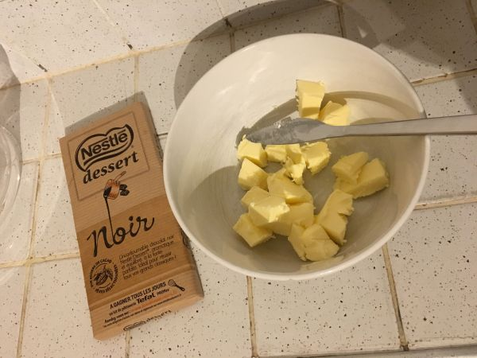

Ajouter le chocolat coupé en carreaux

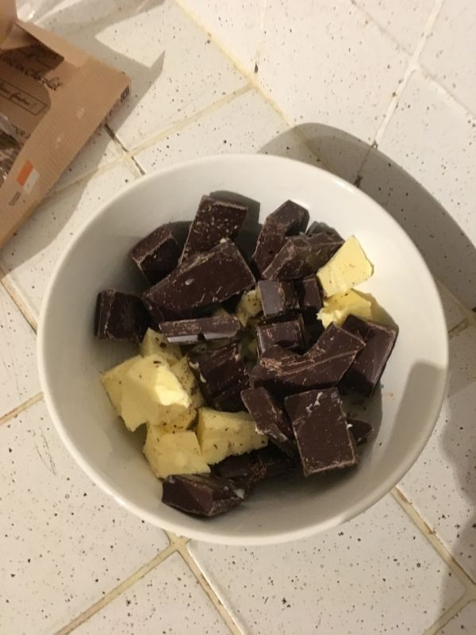

Faire fondre le tout 2 minutes au micro-ondes (750 W)

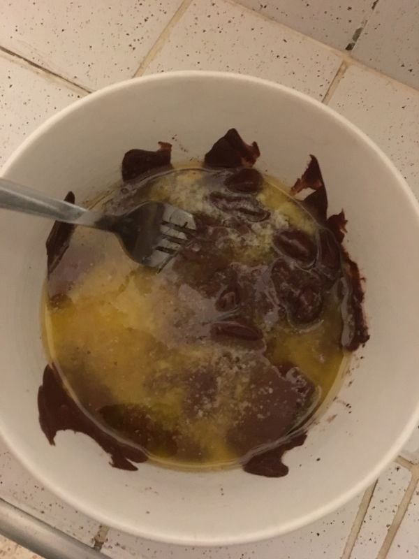

Mélanger jusqu'à obtenir une pâte onctueuse puis laisser refroidir

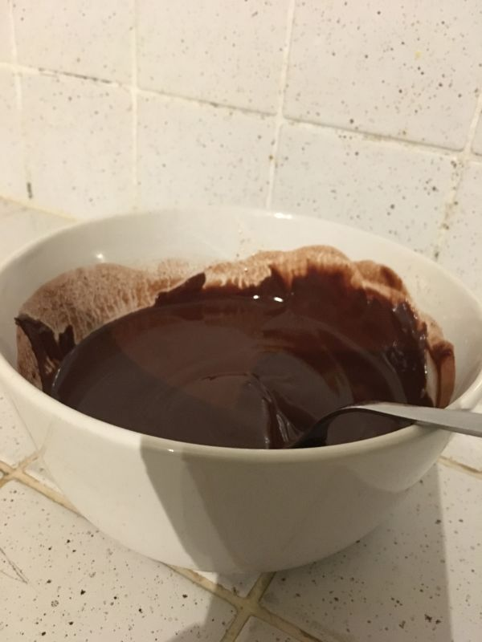

### Préparer les oeufs
Casser les oeufs (entiers) dans un saladier et préparer le sucre

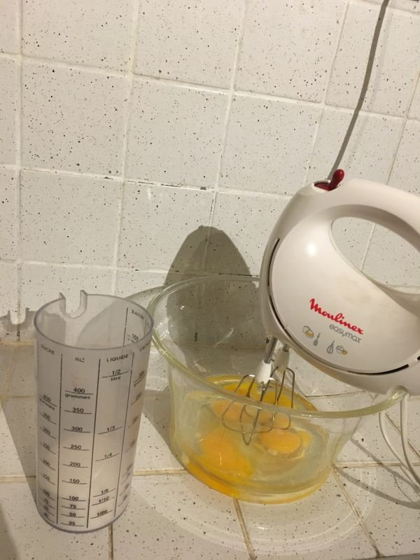

Battre les oeufs au batteur électrique

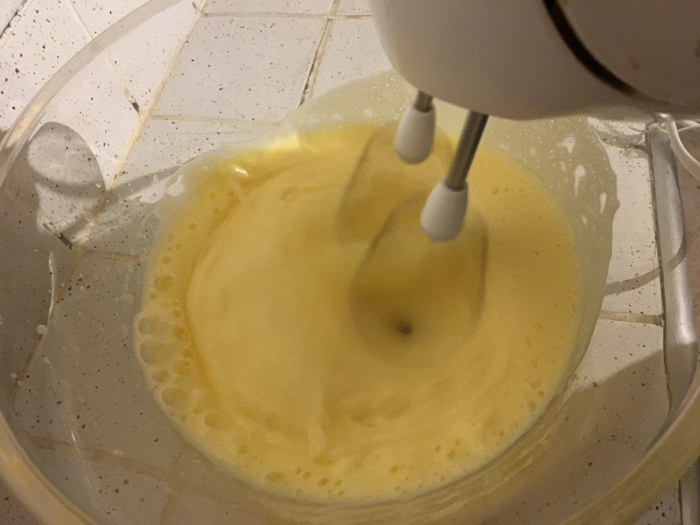

Jusqu'à obtenir une mousse homogène

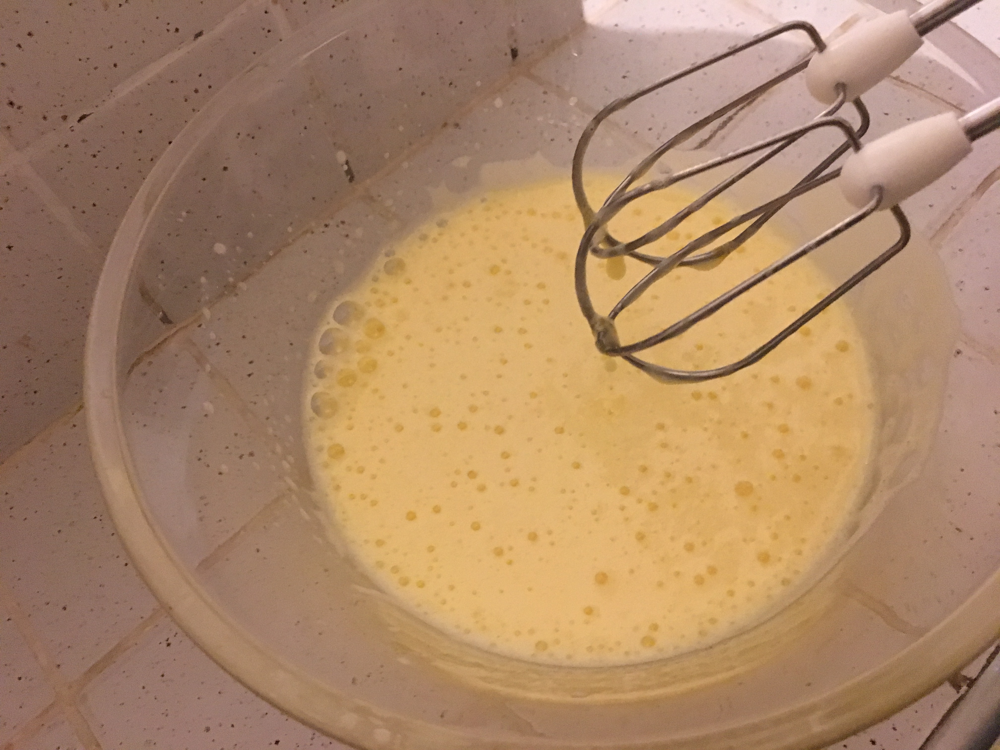

### Mélanger les oeufs et le chocolat
Verser le chocolat fondu dans le saladier

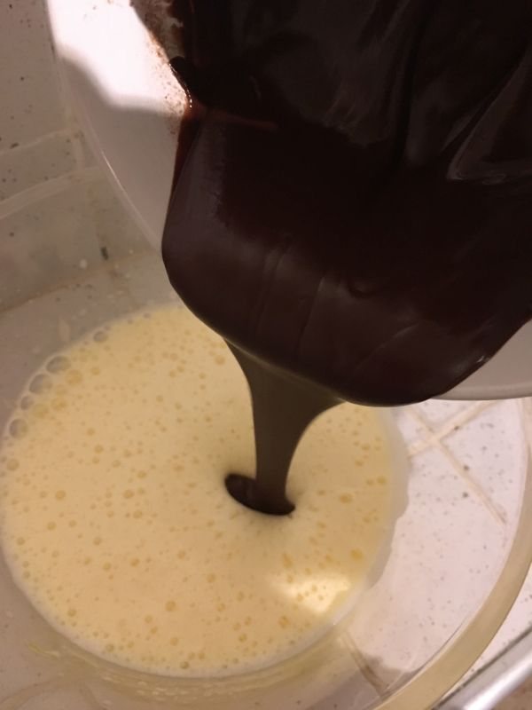

Puis verser progressivement la farine tout en remuant

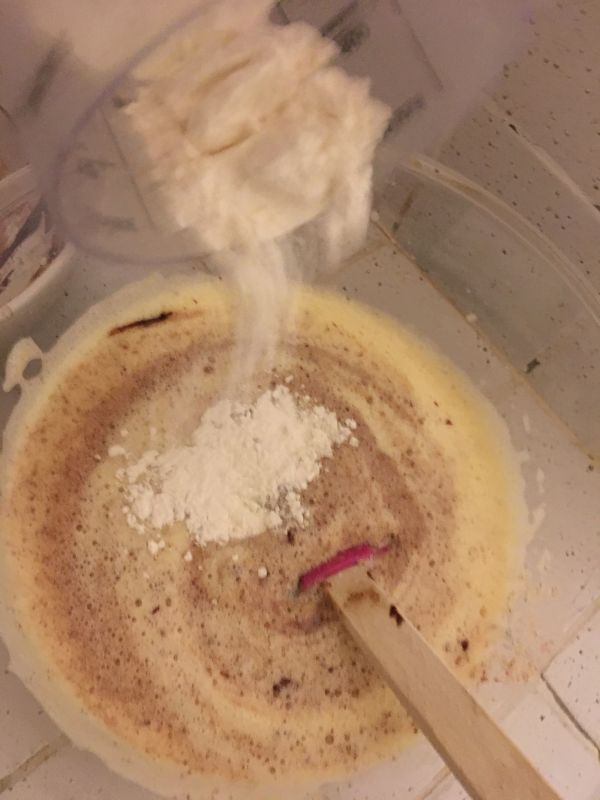

Mélanger jusqu'à obtenir une texture crémeuse

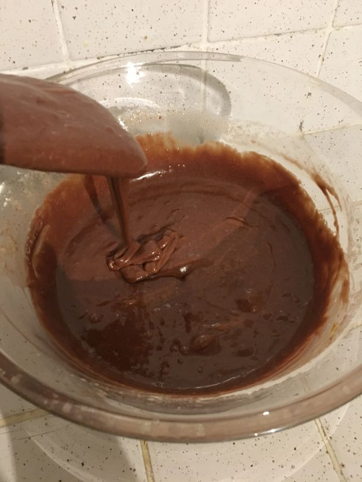

### Préparer la cuisson
Verser la préparation dans le moule

Saupoudrer de pralin

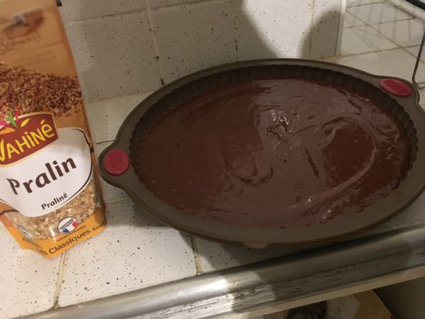

Mettre au four

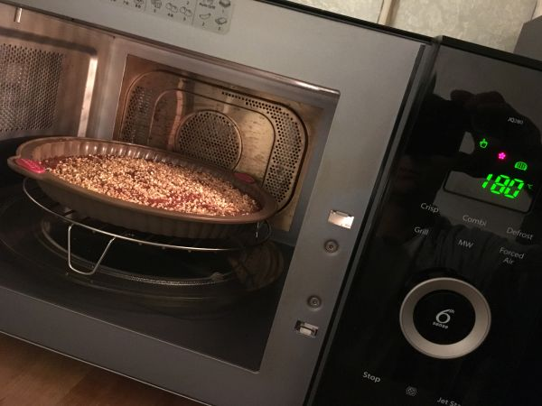

source : [https://www.cuisineaz.com/recettes/fondants-au-chocolat-33045.aspx]

mais :
* les dosages sont différents
* le beurre est demi-sel
* je fais fondre le beurre plus chocolat au micro-ondes
* j'utilise un grand plat
* je saupoudre de pralin [https://www.auchan.fr/vahine-pralin-100g/p-61442?lark-b2cd=1]
