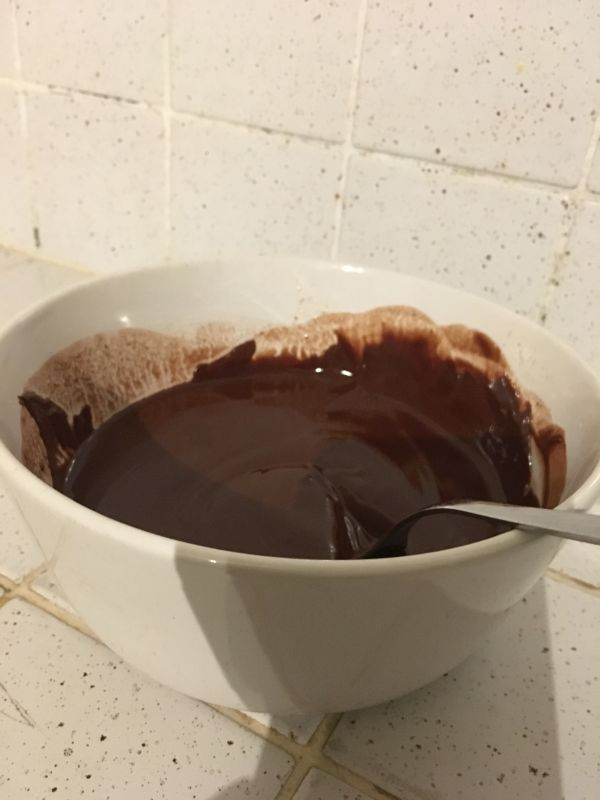
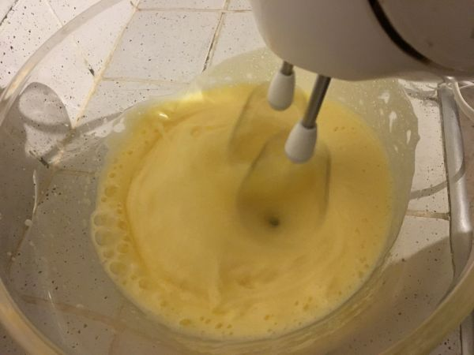
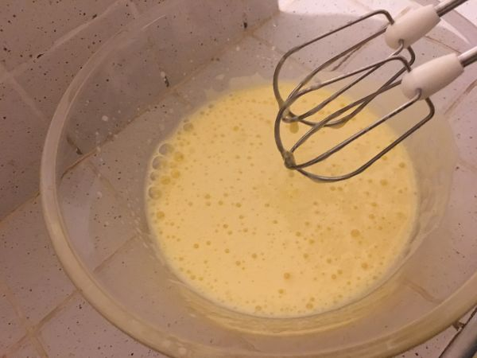
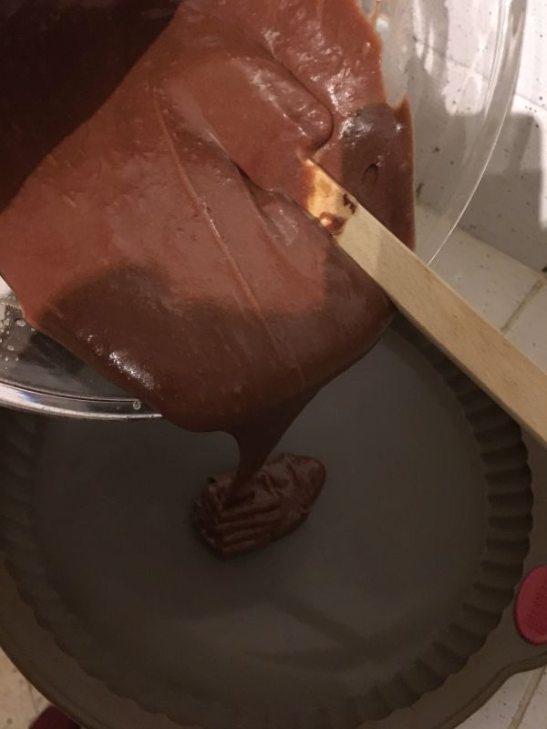

# Mon légendaire fondant au chocolat (super simple)

## Ingrédients
--------------

|  Ingrédient                      | 6 personnes   |
| :--------------------------------| :------------------|
| oeufs                            | 4                  |
| bananes                          | 3                  |
| chocolat noir (tablettes dessert)| 200 g (1 tablette) |
| beurre                           | 200 g              |
| sucre en poudre                  | 160 g              |
| farine                           | 60 g               |
| sucre vanillé                    | 1 sachet 1/3       |

## Cuisson
-----------
35 minutes à 180°C

## Etapes détaillées
--------------------

### 1. Faire fondre le chocolat et le beurre
1.a. Couper le beurre en morceaux

1.b. Ajouter le chocolat coupé en carreaux

1.c. Faire fondre le tout 2 minutes au micro-ondes (750 W)

1.d. Mélanger jusqu'à obtenir une pâte onctueuse puis laisser refroidir

### 2. Préparer les oeufs
2.a. Casser les oeufs (entiers) dans un saladier et préparer le sucre

2.b. Ajouter le sucre puis battre les oeufs au batteur électrique

2.c. Jusqu'à obtenir une mousse homogène

### 3. Mélanger les oeufs et le chocolat
3.a. Verser le chocolat fondu dans le saladier

3.b. Puis verser progressivement la farine tout en remuant

3.c. Mélanger jusqu'à obtenir une texture crémeuse

### 4. Préparer la cuisson
4.a. Verser la préparation dans le moule

4.b. Saupoudrer de pralin

4.c. Mettre au four (durée [ici](#cuisson))

### 5. Dégustez entre amis
Avec une crème anglaise, de la crème chantilly ou bien une boule de glace 😋
