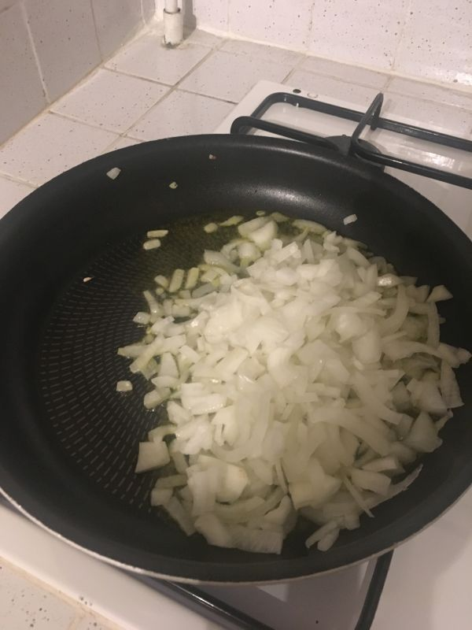
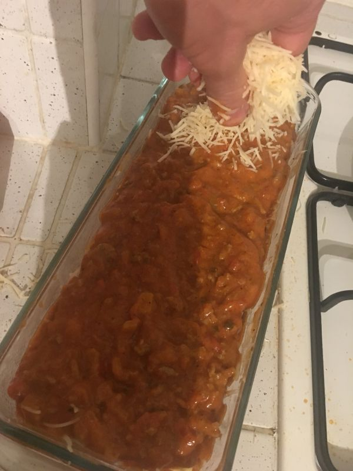
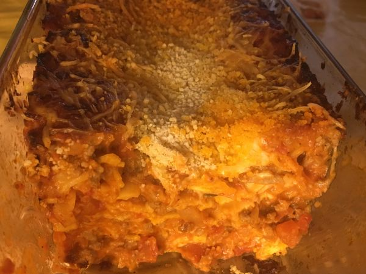

# Mon incroyable lasagne bolognaise *al forno* (inratable)

## Ingrédients
|  Ingrédient                      | Quantité (4 personnes)|
| :--------------------------------| :------------------   |
| Pâtes à lasagnes                 | 1/4 de la boite       |
| Sauce tomate (cuisinée)          | 600 g                 |
| Oignon blanc                     | 1                     |
| Viande hachée (5 %)              | 350 g                 |
| Emmental râpé                    | 400 g                 |
| Sauce béchamel                   | 20 cl (1 briquette)   |
| Chapelure de pain                |                       |
| Huile d'olive                    |                       |
| Noix de muscade en poudre        |                       |
| Poivre                           |                       |

## Cuisson
45 minutes à 180°C dans un moule à cake en Pyrex (type [https://www.boulanger.com/ref/9000047675])

## Étapes détaillées

### 1. Préparer la sauce
1.a. Couper les oignons en dés et les faire revenir dans de l'huile d'olive frémissante

1.b. Une fois les oignons caramélisés, ajouter la viande hachée

1.c. Faire cuire 5 minutes en remuant

1.d. Ajouter la sauce tomate

1.e. Puis la béchamel

1.f. Poivrer et ajouter la noix de muscade

1.g. Mélanger et faire chauffer à feu doux pendant 5 minutes

### 2. Préparer les lasagnes
2.a. Faire préchauffer le four à 180¨C

2.b. Placez une épaisseur de plaques au fond du plat
Les casser à la bonne taille avec la point d'un couteau si besoin

2.c. Nappez avec la sauce jusqu'à recouvrir entièrement la pâte

2.d. Recouvrir entièrement et généreusement avec du fromage râpé

2.e. Recouvrir de nouveau d'une épaisseur de pâte à lasagne

2.f. Et ainsi de suite, jusqu'à arriver à la dernière couche de sauce. Finir par du fromage

2.g. Saupoudrer d'une couche de chapelure de pain pour donner du croustillant au dessus

### 3. Faire cuire au four (180°C)
3.a. Enfourner à mi-hauteur

3.b. Puis sortir au bout de 45 minutes

### 5. Dégustez en famille
(ou avec vos voisins, qui seront forcément attirés par l'irrésistible odeur qui se dégagera de chez vous)

## Source
source : [https://www.marmiton.org/recettes/recette_lasagnes-a-la-bolognaise-tres-facile_70480.aspx]

mais :
* j'utilise de la sauce béchamel toute prête
* je charge beaucoup plus en fromage râpé :)
* je saupoudre de chapelure de pain [https://www.monoprix.fr/courses/fine-chapelure-de-pain-2936568-p]
