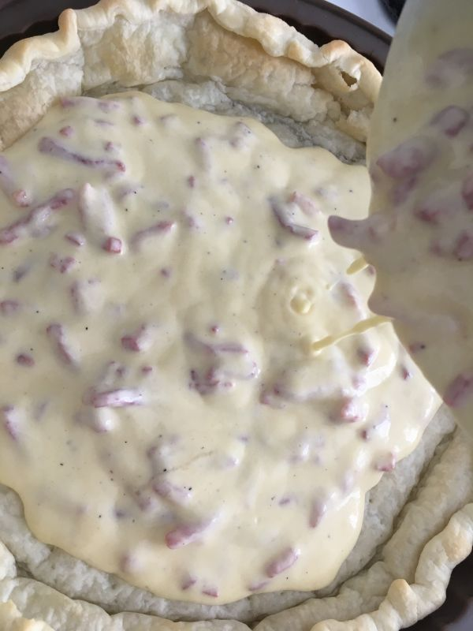

# T'as pas vu Chlorraine ? C'est qui...

## Le contenu de mon caddie...

|  Ingrédient                      | Quantité (4 personnes)|
| :--------------------------------| :------------------   |
| Pâte feuilletée                  | 1                     |
| Crème fraîche                    | 8 cuillères à soupe   |
| Oeufs                            | 3                     |
| Allumettes ou lardons fumées     | 200 g                 |
| Emmental râpé                    | 30 g                  |
| Noix de muscade en poudre        |                       |
| Poivre                           |                       |

## Cuisson
35 minutes à 170°C dans un moule en silicone (type [https://www.amazon.fr/Moule-%C3%A0-tarte-en-silicone/dp/B00H8XTJ7C/ref=psdc_2969429031_t3_B0731PT7RM])

## Étapes détaillées

### 1. Préparer la pâte
1.a. Bien centrer la pâte dans le moule et rabattre la pâte superflue vers l'intérieur

1.b. Faire des trous à la fourchette pour éviter que la pâte ne gonfle lors de la cuisson...

1.c. ...dans un sens puis dans l'autre (à 45°)

1.d. Faire préchauffer le fond de tarte à 180°C pendant 10 minutes

### 2. Préparer la garniture
2.a. Faire cuire les lardons à feu doux

2.b. Enlever le jus de cuisson superflu et finir de les faire dorer

2.c. Casser les oeufs entier dans un grand bol

2.d. Ajouter les 8 cuillères à soupe de crème fraîche

2.e. Poivrer et ajouter la noix de muscade

2.f. Ajouter les alumettes

2.g. Et mélanger la préparation

### 3. Assemblage et cuisson
3.a. Verser la garniture dans le fond de tarte

3.b. Recouvrir d'emmental râpé

3.c. Enfourner à mi-hauteur et cuire pendant 30 minutes à 170°C

### 4. Voilà le résultat, c'est satisfait ou remboursé !

