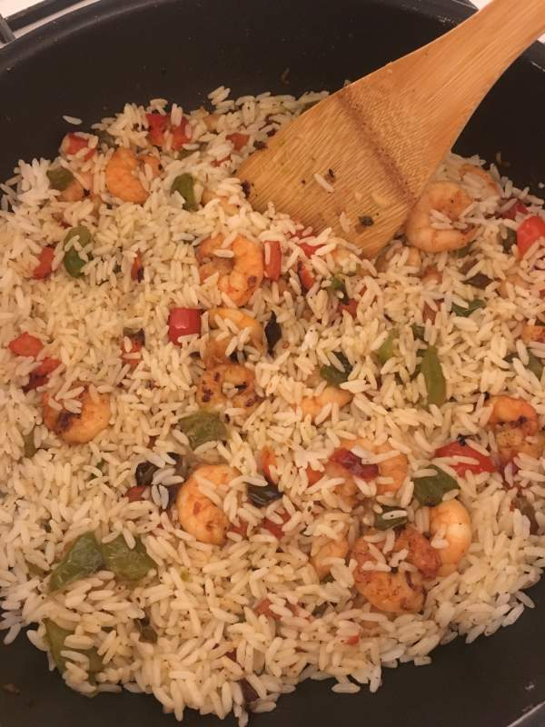

# Mon célèbre riz à la crevette, *la fusion parfaite des iles et de l'Asie* (pour les débutants ou chefs étoilés)

## Le shopping
--------------

|  Ingrédient                       | Quantité (2 personnes)    |
| :---------------------------------| :-------------------------|
| Riz                               | 250 g (2 sachets cuisson) |
| Crevettes décortiquées et cuites  | 200 g                     |
| Poivron vert                      | 1                         |
| Poivron rouge                     | 1                         |
| Piments de Cayenne                | 2                         |
| Gousses d'ail                     | 2                         |
| Crème de coco                     | 500 ml                    |
| Huile d'olive                     |                           |
| Poivre                            |                           |

## Etapes détaillées
--------------------

### Préparation

1. Couper les poivrons en dés et hacher l'aïl

2. Faire cuire le tout à feu doux dans de l'huile d'olive

3. Au bout de 10 minutes de cuisson, ajouter les crevettes

4. Poivrer et ajouter les piments hachés

5. Mettre le riz à chauffer (voir la durée sur la boîte)

6. Une fois les cevettes bien dorées, ajouter progressivement la crème de coco et mélanger

7. Cuire le tout à feu doux pendant 10 minutes

8. Dressez les assiettes en faisant un pâté avec le riz

9. Ajouter la sauce et servez !

<!--- 
//  -->

### Direction le soleil !
Ambiance exotique assurée