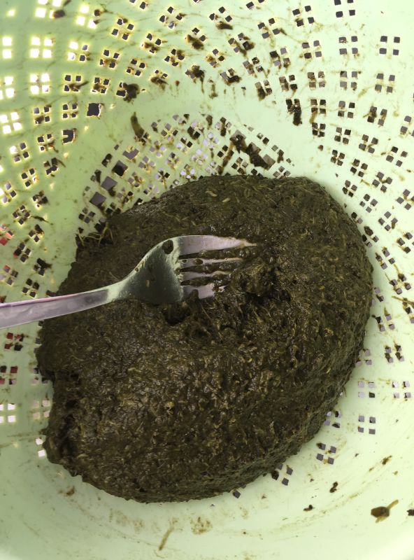
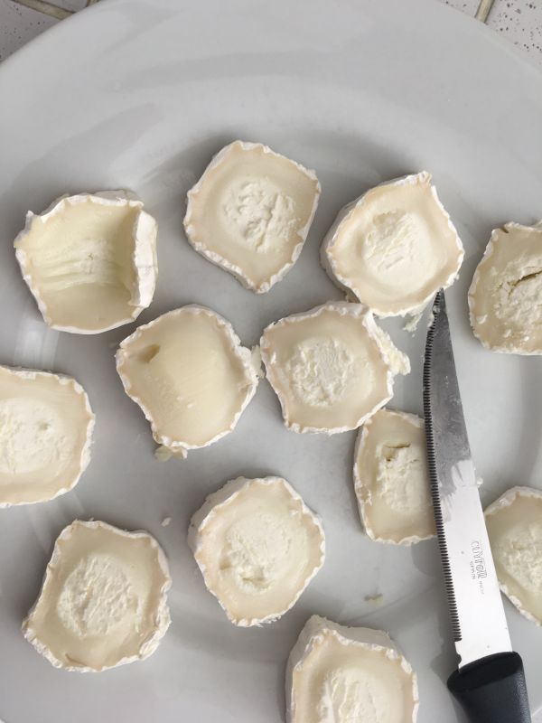

# La tarte au chèvre qui vous fera aimer les épinards

## En passant au supermarché...

|  Ingrédient                      | Quantité (4 personnes)|
| :--------------------------------| :------------------   |
| Pâte brisée                      | 1                     |
| Crème fraîche                    | 5 cuillères à soupe   |
| Chèvre en buche                  | 1 buche               |
| Epinards hachés                  | 800 g (2 boites)      |
| Oeuf                             | 1                     |
| Noix de muscade en poudre        |                       |
| Poivre                           |                       |

## Cuisson
35 minutes à 170°C dans un moule en silicone (type [https://www.amazon.fr/Moule-%C3%A0-tarte-en-silicone/dp/B00H8XTJ7C/ref=psdc_2969429031_t3_B0731PT7RM])

## Étapes détaillées

### 1. Préparer la pâte
1.a. Bien centrer la pâte dans le moule

1.b. Rabattre la pâte superflue vers l'intérieur

1.c. Faire des trous à la fourchette pour éviter que la pâte ne gonfle lors de la cuisson...

1.d. ...dans un sens puis dans l'autre (à 45°)

1.e. Faire préchauffer le fond de tarte à 180°C pendant 10 minutes

### 2. Préparer la garniture
2.a. Bien égoutter les épinards

2.b. Placer les épinards dans un grand bol et ajouter les 5 cuillères à soupe de crème fraîche

2.c. Ajouter l'oeuf entier

2.d. Bien mélanger

2.e. Poivrer

2.f. Découper la buche de chèvre en rondelles

### 3. Assemblage et cuisson
3.a. Verser la garniture dans le fond de tarte

3.b. Bien aplanir la garniture

3.c. Ajouter les buchettes de chèvre

3.d. Enfourner à mi-hauteur et cuire pendant 30 minutes à 170°C

### 4. Régalez-vous !

