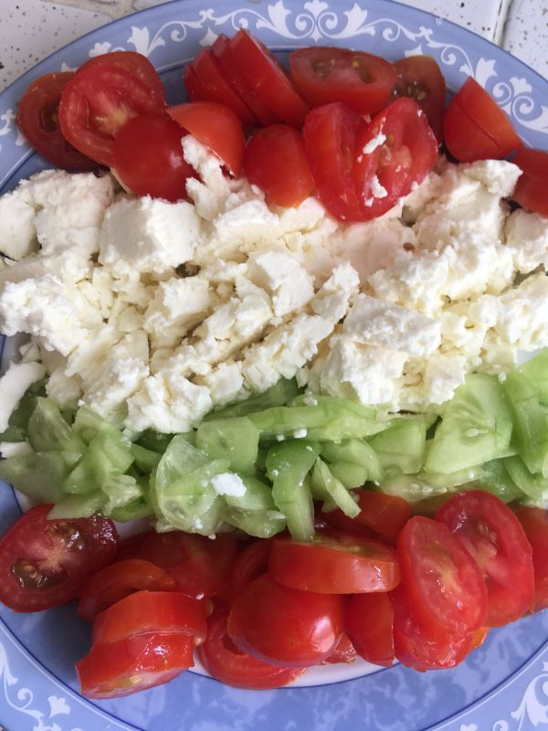

# Les seuls wraps veggie au poulet et à la féta

## Les fournitures
------------------

|  Ingrédient                       | Quantité (4 wraps)    |
| :---------------------------------| :---------------------|
| Filet de poulet                   | 150 g                 |
| Coleslaw                          | 100 g                 |
| Mini-tomates                      | 8                     |
| Mini-concombre                    | 1/2                   |
| Féta                              | 100 g                 |
| Salade                            | 50 g                  |
| Galettes tortillas (blé)          | 4                     |

## Etapes détaillées
--------------------

### 1. Le poulet
1.a. Faire cuire le poulet coupé en morceaux dans du beurre

1.b. Une fois les morceaux bien dorés, les couper en petits dés

### 2. La garniture
2.a. Couper les mini-tomates en rondelles

2.b. Couper la féta en dés

2.c. Couper le mini-concombre en dés

### 3. L'assemblage
3.a. Mettre le coleslaw dans un grand bol

3.b. Verser le reste de la garniture

3.c. Ajouter les dés de poulet

3.d. Ajouter la salade et mélanger le tout

 

### 4. Installer la préparation et les tortillas sur la table

### 5. Préparer les wraps
5.a. Charger une galette avec la préparation

6.b. Rabattre le bas de la galette

6.b. Puis les bords gauche et droite

### 6. Régalez-vous sainement

